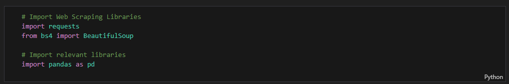
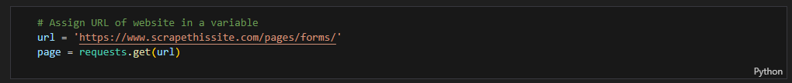
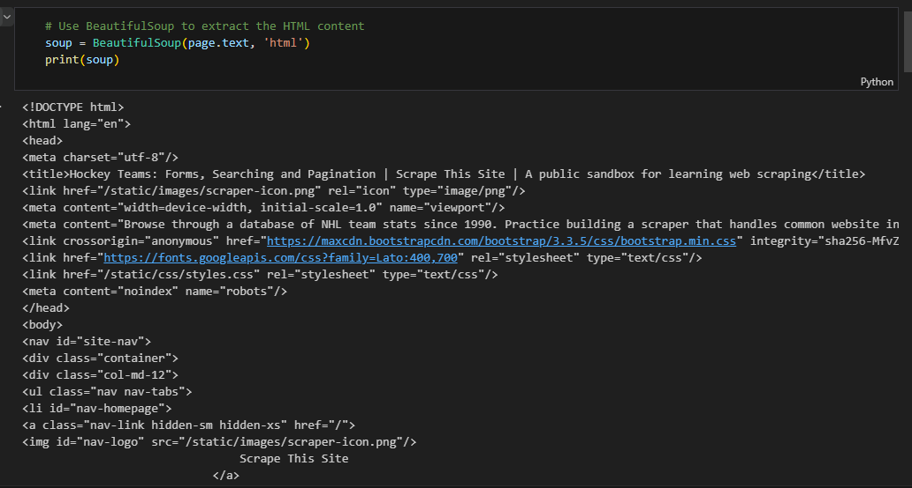
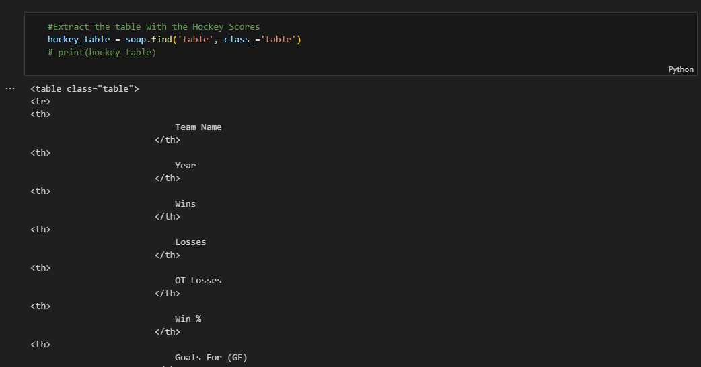
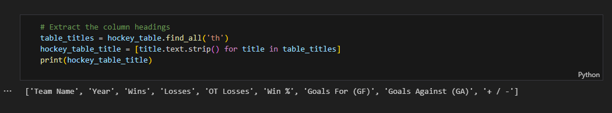
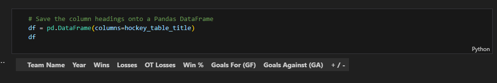
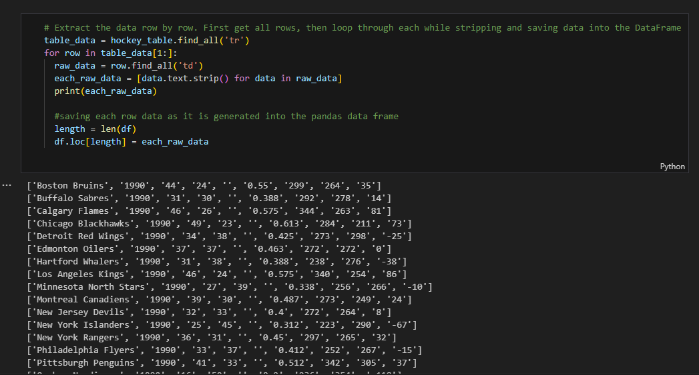
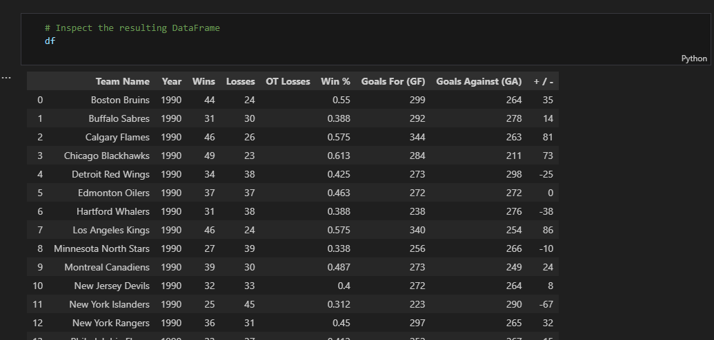
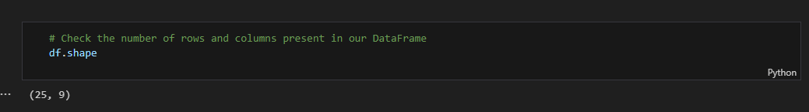
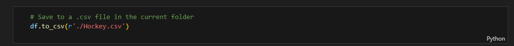

# Automating Web Data Gathering using Python

## Introduction
This project aims at automating web data gathering using Python and on Jupyter Notebook hosted on Google Colab.  It entails obtaining structured data from a live website i.e.

Three important libraries were used: `Requests` for handling HTTP requests, `BeautifulSoup` for parsing HTML, and `pandas` for storing and manipulating data. 
Data was collected and organized into a `DataFrame`, and the results exported to a `.csv` file. 

## Project Execution

1. Important libraries requests, BeautifulSoup, and pandas were imported

2. The link to the live website was then assigned to a variable url and requests to handle http requests from the website

3. Data was extracted from the provided web page using `BeautifulSoup` library

4. Hockey scores data table was extracted from the entire dataset

5. The table headers were extracted from the table as part of data wrangling

6. The Hockey table headers were then saved in a Pandas DataFrame

7. Loop through the entire dataset and save the data to a Pandas DataFrame

8. Inspect the DataFrame

9. Check the shape. The Hockey DataFrame consists of 25 rows and 9 columns

10. The Hockey DataFrame was saved as a .csv file

## Conclusion
The structured data obtained from the website consisted of 25 rows and 9 columns. The columns include [`Team Name`, `Year`, `Wins`, `Losses`, `OT Losses`, `Win %`, `Goals For (GF)`, `Goals Against (GA)`, `+ / -`]. It was stored into a Pandas DataFrame and later saved as a .csv file (`Hockey.csv`). 
The link to the code can be obtained below:

