# Exploratory Data Analysis on Titanic Dataset

## History of the Titanic
The RMS Titanic was a British cruise ship that sank on April 15, 1912, during its maiden voyage from `Southampton`, `England`, to `New York City`. It was the largest ship in the world at the time, measuring 882 feet long and 92 feet wide, and displacing 52,310 long tons. The Titanic departed from `Southampton` on April 10, 1912, stopping at the French port of `Cherbourg` and the Irish port of `Queenstown` to pick up more passengers before setting off across the Atlantic Ocean.
Despite receiving several ice warnings, the Titanic continued at full speed, and at 11 p.m. on April 14, 1912, lookout Fred Fleet spotted an iceberg dead ahead. First Officer William Murdoch ordered the ship turned hard to port and signaled the engine room to reverse direction, but the ship was too large, moving too fast, and the iceberg was too close. The Titanic struck the iceberg, causing several compartments to begin filling with water.
The ship's design included a double-hull and 16 watertight compartments sealed by massive doors that could be instantly triggered by a single electric switch on the bridge or automatically by electric water-sensors. However, the ship was not designed to withstand a collision that would flood more than four compartments, and the iceberg had caused five compartments to begin filling with water. The ship began to sink, and the crew began to get people aboard the lifeboats. There were not enough lifeboats for all the passengers, and many left the Titanic only half full.
The Titanic sank at 2 a.m. on April 15, 1912, with approximately 1,500 people still on board. The disaster led to the establishment of the International Ice Patrol and the first International Convention for Safety of Life at Sea, which required every ship to have lifeboat space for each person embarked, hold lifeboat drills, and maintain a 24-hour radio watch.

## Objective
* To conduct an Exploratory Data Analysis on the Titanic dataset. This includes  `Univariate`, `Bivariate`, `Multivariate`,  `Outlier`, and `Target Analysis` of the data.

## Data Dictionary
|  Feature Name    |  Description                                   |  Category (Optional)            |
|------------------|------------------------------------------------|---------------------------------|
|PassengerId       |Unique identifier of the passenger              |                                 |
|Survived          |Survival                                        |0 = No, 1 = Yes                  |
|Pclass            |Ticket class                                    |1 = Upper, 2 = Middle, 3 = Lower |
|ame               |Name of the passenger                           |                                 |
|Sex               |Gender of the passenger                         |male, female                     |
|Age               |Age in years                                    |                                 |
|SibSp             |Number of siblings / spouses aboard the Titanic |                                 |
|Parch             |Number of parents / children aboard the Titanic |                                 |
|Ticket            |Ticket number                                   |                                 |
|Fare              |Passenger fare                                  |                                 |
|Cabin             |Cabin number                                    |                                 |
|Embarked          |Port of Embarkation                             |S, C, Q                          |

The Embarked Category consists of:
1. Southamption (S)
2. Cherbourg (C)
3. Queenstown (Q)

## Project Process
1. Importing relevant libraries
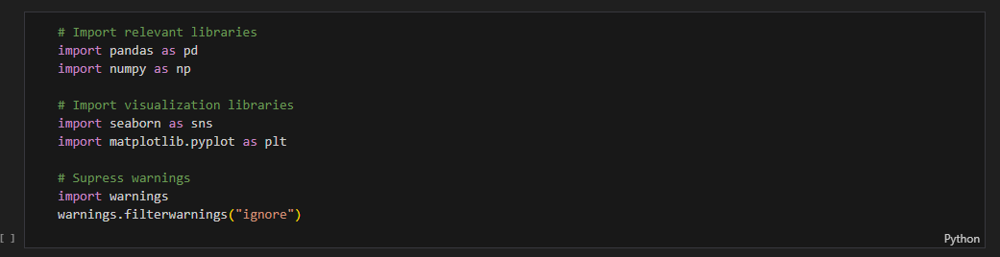

2. Data was loaded into the Pandas DataFrame

3. Checking the first five rows of the titanic dataset
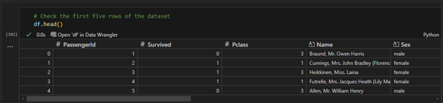

### Data Preprocessing

4. Checking for the number of rows and columns
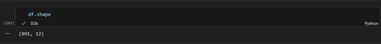
* The dataset consisted 891 rows and 12 columns

5. Check columns in the dataset
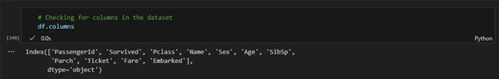

6. Check for irregularities in the dataset
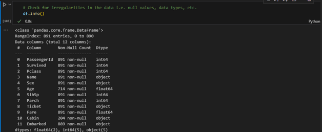
* Presence of missing values in `Age`, `Cabin`, and `Embark` columns

7. Check the percentage of missing values
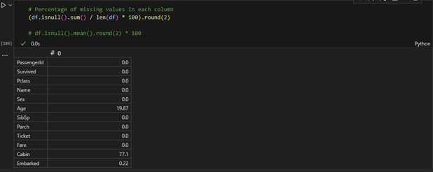
* From the dataset, `Age` has `19.87%` missing values, `Cabin`, `77.10%` missing values, and `Embarked`, `0.22%` missing values

8. Check for statistics
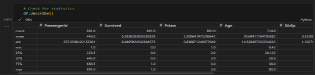
* From the statistics above, `Age`, `SibSp`, `Parch`, and `Fare` columns consisted of extreme values in their `75th` percent which might imply presence of `outliers`

9. Check for duplicates
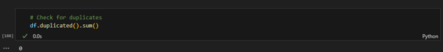
* No duplicates found

10. Checking specific ports in the Embark column
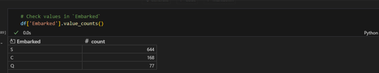
* Southampton port constituted the largest number passengers’ destination followed by Cherbourg port, then Queenstown port with `72.5%`, `18.86%`, and `8.64%` respectively

### Data Imputation
11. Fill null values in the Age column using the mean value
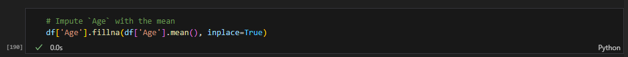

12. Fill Embark value with the most common i.e. `Southampton`
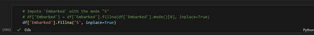

13. Drop irrelevant column
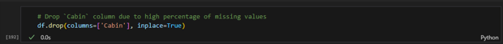

14. Check the number of survivors
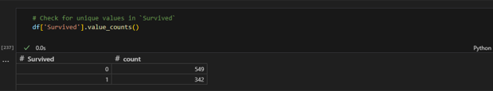
* From the titanic dataset, `61.62%` of the population lost their lives during the accident with `38.38%` surviving

## Exploratory Data Analysis
**Objective**
* To analyze and investigate data sets and summarize their main characteristics, often employing data visualization methods.
**Benefits**
* Helps determine how best to manipulate data sources to get the answers you need, making it easier for data scientists to discover patterns, spot anomalies, test a hypothesis, or check assumptions.

### Univariate Analysis
* The data being analyzed consists of just one variable

