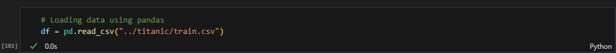
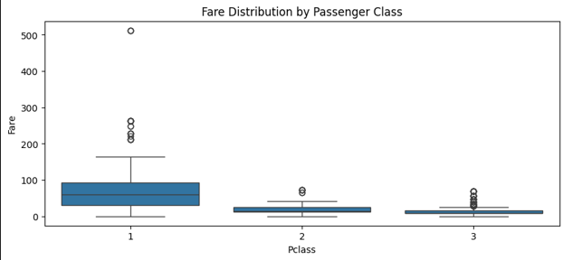

# Exploratory Data Analysis on Titanic Dataset

## History of the Titanic
The RMS Titanic was a British cruise ship that sank on April 15, 1912, during its maiden voyage from `Southampton`, `England`, to `New York City`. It was the largest ship in the world at the time, measuring 882 feet long and 92 feet wide, and displacing 52,310 long tons. The Titanic departed from `Southampton` on April 10, 1912, stopping at the French port of `Cherbourg` and the Irish port of `Queenstown` to pick up more passengers before setting off across the Atlantic Ocean.
Despite receiving several ice warnings, the Titanic continued at full speed, and at 11 p.m. on April 14, 1912, lookout Fred Fleet spotted an iceberg dead ahead. First Officer William Murdoch ordered the ship turned hard to port and signaled the engine room to reverse direction, but the ship was too large, moving too fast, and the iceberg was too close. The Titanic struck the iceberg, causing several compartments to begin filling with water.
The ship's design included a double-hull and 16 watertight compartments sealed by massive doors that could be instantly triggered by a single electric switch on the bridge or automatically by electric water-sensors. However, the ship was not designed to withstand a collision that would flood more than four compartments, and the iceberg had caused five compartments to begin filling with water. The ship began to sink, and the crew began to get people aboard the lifeboats. There were not enough lifeboats for all the passengers, and many left the Titanic only half full.
The Titanic sank at 2 a.m. on April 15, 1912, with approximately 1,500 people still on board. The disaster led to the establishment of the International Ice Patrol and the first International Convention for Safety of Life at Sea, which required every ship to have lifeboat space for each person embarked, hold lifeboat drills, and maintain a 24-hour radio watch.

## Objective
* To conduct an Exploratory Data Analysis on the Titanic dataset. This includes  `Univariate`, `Bivariate`, `Multivariate`,  `Outlier`, and `Target Analysis` of the data.

## Data Dictionary

|  Feature Name     |  Description                                    |  Category (Optional)             |
|-------------------|-------------------------------------------------|----------------------------------|
| PassengerId       | Unique identifier of the passenger              |                                  |
| Survived          | Survival                                        | 0 = No, 1 = Yes                  |
| Pclass            | Ticket class                                    | 1 = Upper, 2 = Middle, 3 = Lower |
| Name              | Name of the passenger                           |                                  |
| Sex               | Gender of the passenger                         | male, female                     |
| Age               | Age in years                                    |                                  |
| SibSp             | Number of siblings / spouses aboard the Titanic |                                  |
| Parch             | Number of parents / children aboard the Titanic |                                  |
| Ticket            | Ticket number                                   |                                  |
| Fare              | Passenger fare                                  |                                  |
| Cabin             | Cabin number                                    |                                  |
| Embarked          | Port of Embarkation                             | S, C, Q                          |

The Embarked Category consists of:
1. Southamption (S)
2. Cherbourg (C)
3. Queenstown (Q)

## Project Process
1. Importing relevant libraries

2. Data was loaded into the Pandas DataFrame

3. Checking the first five rows of the titanic dataset

### Data Preprocessing

4. Checking for the number of rows and columns

* The dataset consisted 891 rows and 12 columns

5. Check columns in the dataset

6. Check for irregularities in the dataset

* Presence of missing values in `Age`, `Cabin`, and `Embark` columns

7. Check the percentage of missing values

* From the dataset, `Age` has `19.87%` missing values, `Cabin`, `77.10%` missing values, and `Embarked`, `0.22%` missing values

8. Check for statistics

* From the statistics above, `Age`, `SibSp`, `Parch`, and `Fare` columns consisted of extreme values in their `75th` percent which might imply presence of `outliers`

9. Check for duplicates

* No duplicates found

10. Checking specific ports in the Embark column

* Southampton port constituted the largest number passengers’ destination followed by Cherbourg port, then Queenstown port with `72.5%`, `18.86%`, and `8.64%` respectively

### Data Imputation
11. Fill null values in the Age column using the mean value

12. Fill Embark value with the most common i.e. `Southampton`

13. Drop irrelevant column

14. Check the number of survivors

* From the titanic dataset, `61.62%` of the population lost their lives during the accident with `38.38%` surviving

## Exploratory Data Analysis
**Objective**
* To analyze and investigate data sets and summarize their main characteristics, often employing data visualization methods.
**Benefits**
* Helps determine how best to manipulate data sources to get the answers you need, making it easier for data scientists to discover patterns, spot anomalies, test a hypothesis, or check assumptions.

### Univariate Analysis
* The data being analyzed consists of just one variable
15. Visualizing the number of survivors

The number of passengers who survived the accident was low compared to the passengers who perished

16. Distribution of Age

The Age is distributed at the middle between age 20 and 40. - The number of passengers were positively skewed according to age

17. Distribution of Embarked locations

Majority passengers were destined for Southampton

18. Distribution of Pclass

Majority of the passengers preferred 3rd class over 1st and 2nd class

19. Distribution of ticket fare

The plot is skewed to the right meaning majority of the passengers paid less than 100 for the service

## Bivariate Analysis
This allows you to assess the relationship between each variable in the dataset and the target variable you’re looking at

20. Relationship between Pclass and Survived

Majority of passengers in the 1st class survived the accident compared to the passengers in the 2nd and 3rd class. Many passengers in the 3rd class succumbed to the accident

21. Relationship between Pclass and Fare

Presence of extreme fare values in 1st class compared to the other classes, i.e., 2nd and 3rd classes were cheaper than 1st class

22. Relationship between Sex and Survived

Majority of men succumbed to the accident compared to women

23. Relationship between Age and Survived

The population that survived included individuals of extreme age like 80 years. This is an outlier that could be further investigated

24. Relationship between Fare and Survived

There is a relationship between passengers who paid high fares and survival. The higher the fare price, the higher the chances of survival

## Multivariate Analysis
Used for mapping and understanding interactions between different features in the data

25. Relationship between Pclass, Age, and Survived

* There is a relationship between passengers who were in 1st class, age, and survival rate
* Majority of passengers who survived the accident belonged to the 1st class and were averagely in their 30s, with the passengers surviving in the 2nd and 3rd class being below 30 years
* Majority of the passengers in the 1st class who died were above 30 compared to passengers in the 2nd and 3rd class which contained passengers of below 30 years succumbing to the accident

26. Relationship between Pclass, Age, and Fare

Passengers who occupied 1st class paid higher fares compared to passengers in the 2nd and 3rd classes who paid 100

27. Relationship between survived, Embarked, and Pclass

* There is a correlation between passengers who boarded 1st class and were destined for Cherbourg port. Majority of the passengers survived the accident
* There is also a correlation between passengers who boarded 2nd class and were destined for Queenstown port. Majority of this group survived the accident as well
* Majority of passengers who boarded 3rd class and were destined for Southampton port succumbed to the accident with low survival rate

## Outlier Detection and Handling

28. Check for outliers

There are presence of outliers in Age, SibSp, Parch, and Fare columns

### Handling Outliers
Outliers cannot be removed because:
* It can lead to loss of valuable information, distorting the dataset and/or tampering with the integrity of the data.
* It can be used to detect rare events such as elderly surviving the titanic accident as seen in the dataset.
* It can be used to improve predictions during modeling in future and support insights.
* It can introduce biasness in the dataset especially if the outlier is meaningful and not an error.

## Target Variable Exploration
A target variable is the variable that the user would want to predict using the rest of the dataset especially in supervised machine learning model

29. Analyze the survived column

61.62% of the passengers lost their lives from the titanic accident while 38.83% survived

30. Distribution of Survived by Pclass

Most passengers who survived the accident came from the 1st class, while majority of the passengers who died from the accident came from 3rd class. In 2nd class, both survivors and those who died were of average population

31. Distribution of Survived by Sex

The number of female passengers who survived the accident were more compared to men

32. Distribution of survived by Embarked

Passengers destined for Southampton port contained both high deaths and survival rates compared to Cherbourg and Queenstown ports. Most passengers destined for Cherbourg port survived the accident

33. Distribution of survived by Age

* Majority of passengers who died and survived the accident were averagely in their mid-20s and mid-30s respectively.
* There were outliers in the deaths which included children below approximately 5 years and passengers above the age of 50.
* However, there were survivors who were approximately 60 years and above who are part of the outliers.

34. Distribution of survived by Fare

Passengers who paid higher fares were likely to survive the accident compared to the majority who paid below 100

35. Relationship between Pclass, Sex, and Survived

Majority of passengers who survived the accident were in 1st class compared to 2nd and 3rd classes. 3rd class experiences the highest death rates

## Conclusion
In conclusion, few passengers survived the accident. i.e. 61.62% of the population succumbed to the accident compared to 38.38% who survived. Majority of passengers who boarded the titanic were between the age of 20 and 40 accounting for the young adults in the population. Majority of passengers in the 3rd class died compared to 1st and 2nd class. Majority of men succumbed to the accident compared to women. Majority of the passengers who succumbed to the accident were destined for Southampton port. However, there was an exception case of an elderly who survived accident that need to be looked into.  
For more information, click the link below:

