# Human Resources Dashboard

## About the Project
This project aims at analyzing and visualizing a dashboard that will be used by the HR department to make decisions.
The dataset was obtained from the following link but customized to the Kenyan context:

The dataset consisted of the following 15 features:
1. employee_id
2. first_name
3. last_name
4. gender
5. state
6. city
7. hiredate
8. department
9. job_title
10. education_level
11. salary
12. performance_rating
13. overtime
14. birthdate
15. termdate

## Objectives
The project aims at:
1.	Understanding the business and client needs
2.	Loading Data
3.	Transforming Data
4.	Creating Calculated Measures
5.	Visualizing Dashboard
6.	Publishing the project 

# Project Execution
## Data Loading and Transformation
The dataset was loaded into Tableau by connecting the .csv dataset as shown below. The dataset was customized to the `Kenyan` context. 
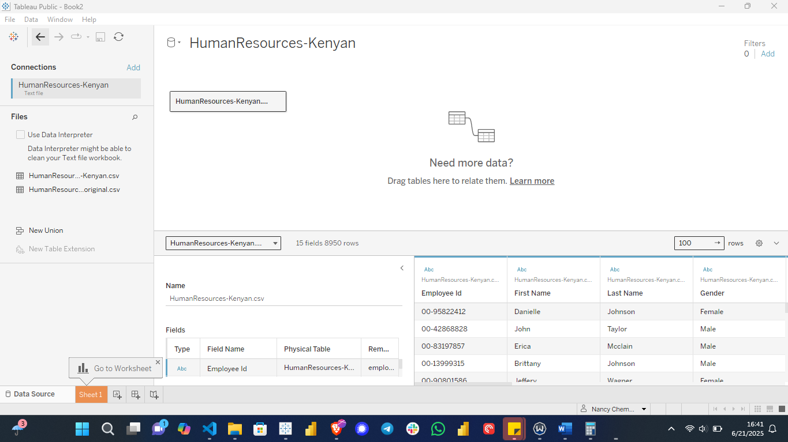 

The data was transformed whereby the properties were adjusted.
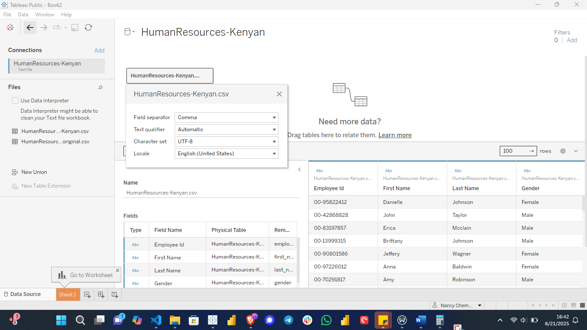

The colors were customized for the entire workbook.
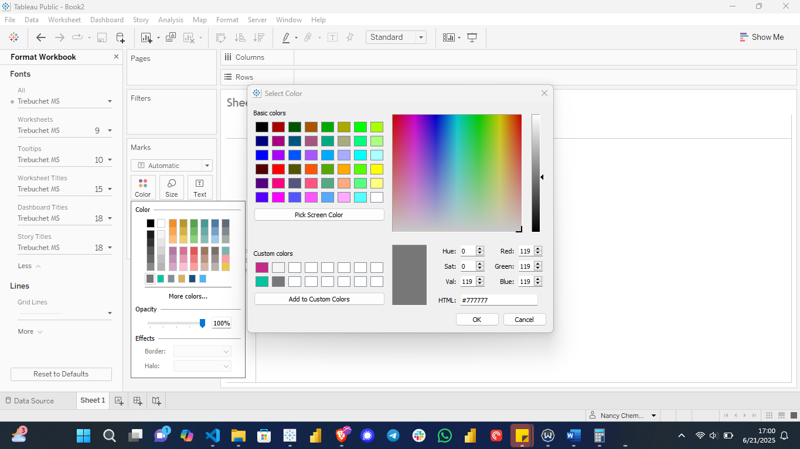

The data was transformed by mapping 15 branches to their states.
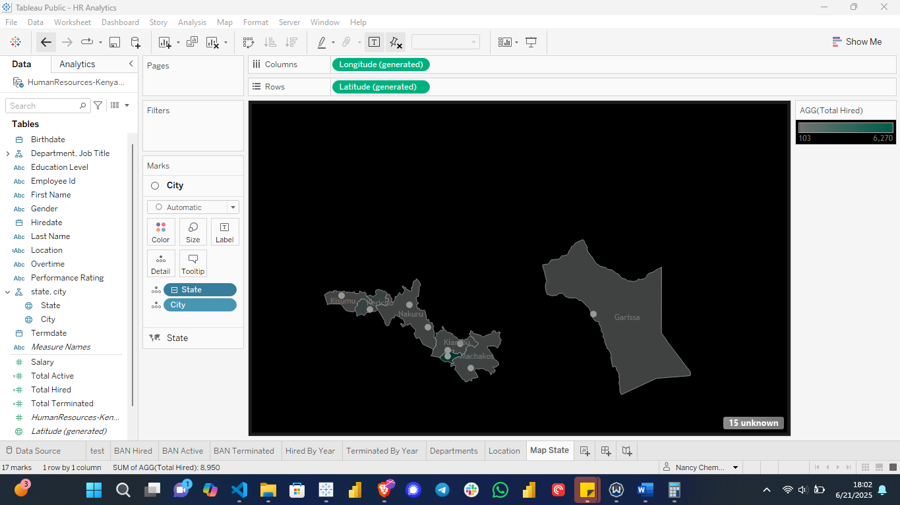

## Calculated Measures
The following calculated measures were created: `Total Hired`, `Total Terminated`, `Total Active`, `% Total Hired`, `% Total Terminated`, `Age`, among others.
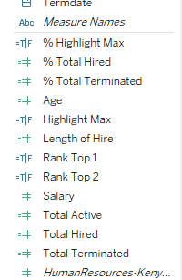

Relationships between `department` and `job title`, and among `Location`, `State`, and `Cities` were created.
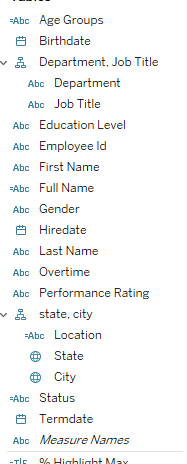

## Building Visualizations
### Summary of the employees hired by year

`2025` recorded the highest number of employees hired, 1,548 contributing to 17% compared to `2021` which recorded the lowest hiring numbers of up to 457, accounting for 5%.

### The number of employees terminated by year

`2024` recorded the highest number of employees terminated, 197 contributing to 20% termination rate. `2016` being the lowest recorded 1% termination rate with 7 employees being terminated.  
 
### Summary of employees hired and terminated by department.
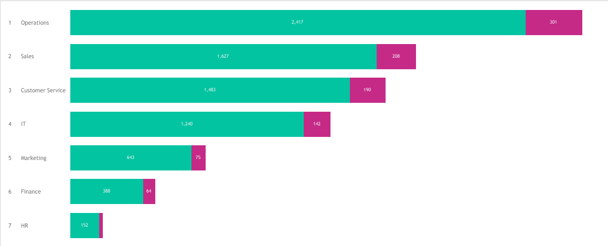
The green color represents the hired and pink the terminated.

### The total number of employees by job title.
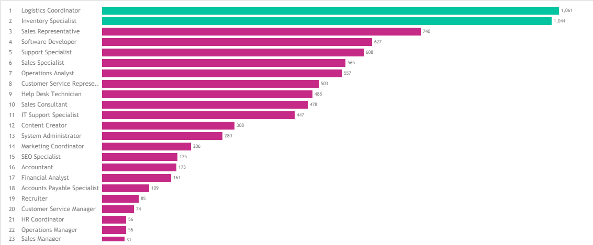
The employees in green represents job titles with majority of the employees.

### The total number of employees by State
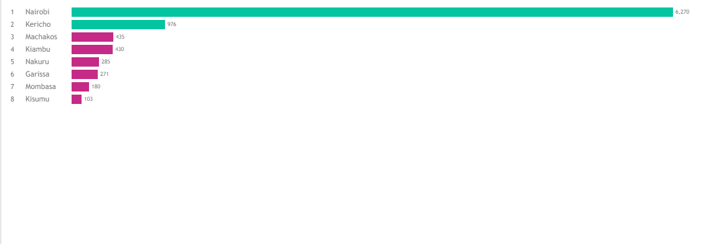
Nairobi consists of the highest number of employees compared to other states.

### The total number of employees by location.
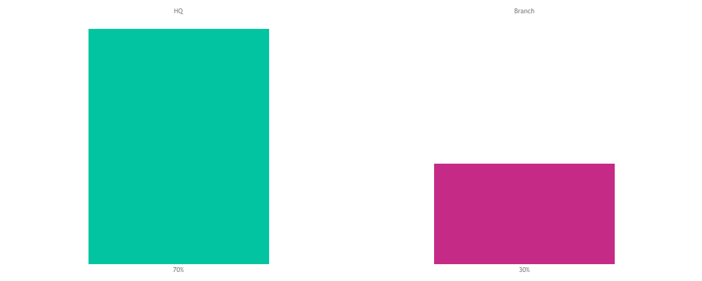
The `Headquarter` (Nairobi) consisted of 70% employees.

### Map showing location of the branches.
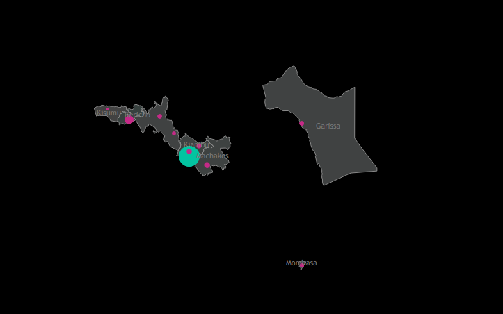
The blue bubble indicates the `Headquarter` while the pink shows `Branches` in different states. Also, the bubble size increases and decreases depending on the number of employees in a location. 

### The percentage of active, hired, and terminated employees by gender
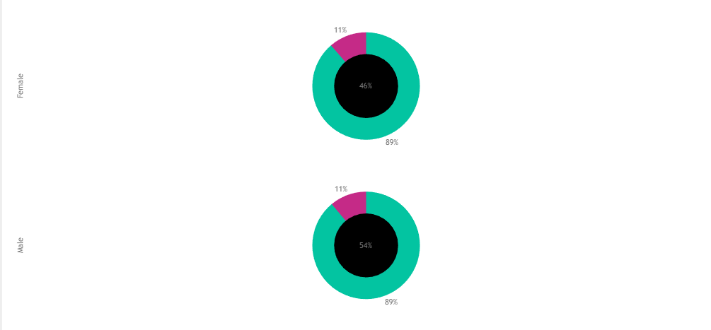
Color green represents the percentage of hired employees while color pink, the percentage of terminated employees by `Gender`. The middle circle represents the percentage of the employees of a particular gender. 

### Heatmap showing Education level by age
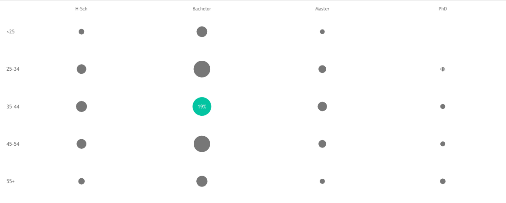
Employees with bachelor’s degree and within the age of between 34 to 44 contributed to 19% and the highest among the rest.

### The total number of employees by age
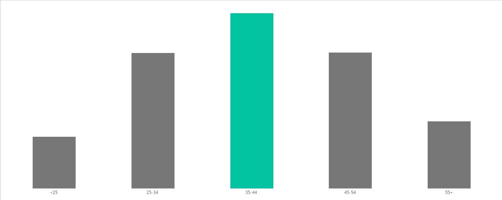
The employees between ages 35 and 44 contributed to 31% of employees in the organization.

### The total number of employees by education level
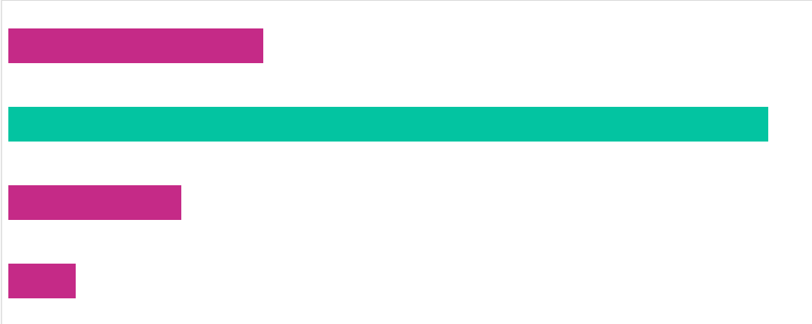 
The highest number of employees hired have bachelors’ degree.

### Employee performance by education level
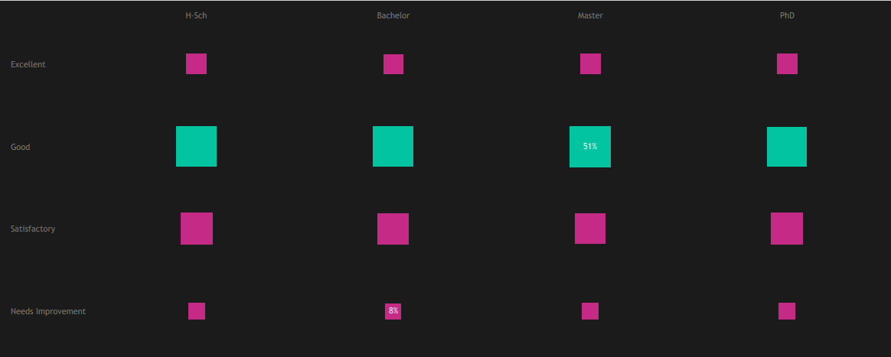 
Employees with masters were rated good in terms of performance contributing to 51%.

### Heatmap on education level by gender and salary
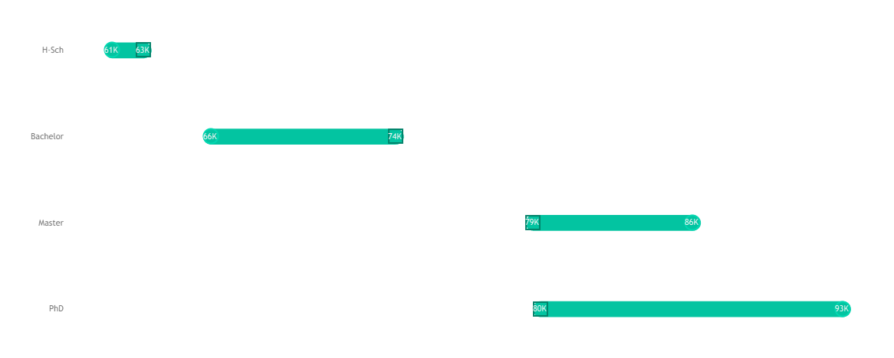 
Employees with PhD were paid the highest salaries.

### Scatterplot of salary versus department
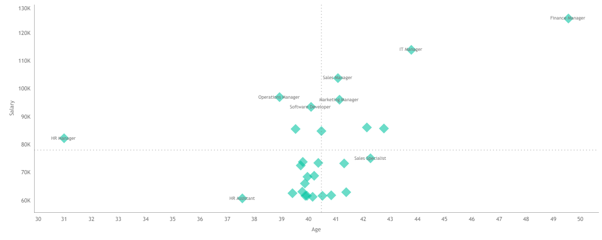 
Finance managers were the highest paid employees compared to other job roles.

## Summary Dashboards
The following is the summary of my findings:
### HR Summary Dashboard
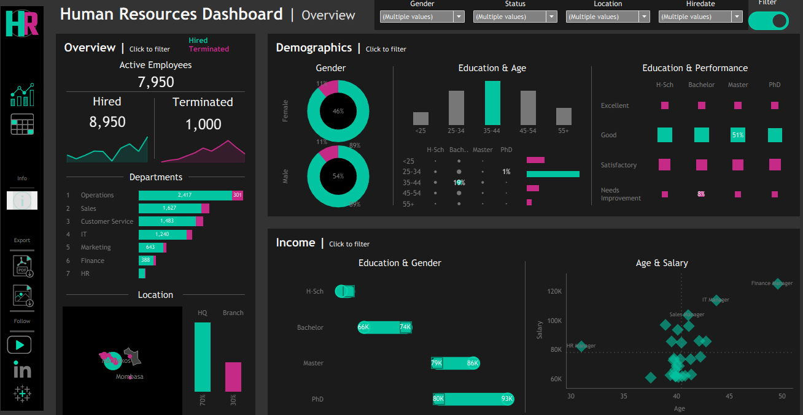

### HR Details
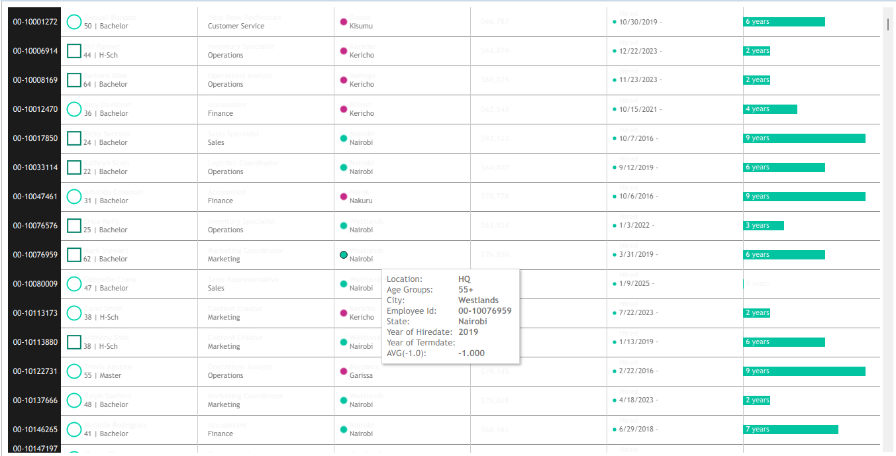 

## Conclusion
To sum up, the number of active, hired and terminated employees were 7,950, 8,950, and 1000 respectively. The operations department contributed to the highest number of employees hired i.e. 2,417 and terminated i.e. 301 compared to the rest. The project was published on Tableau Public as seen in the link below:
https://public.tableau.com/app/profile/nancy.chemutai/viz/HRSummaryDashboard_17505277057340/HRSummaryDashboard

