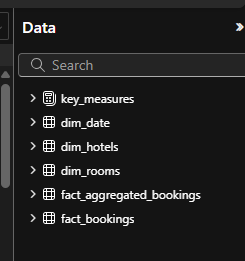
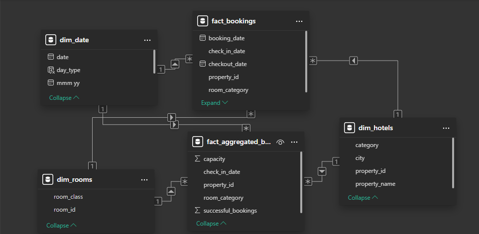
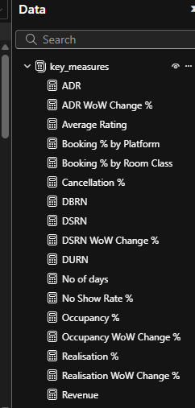
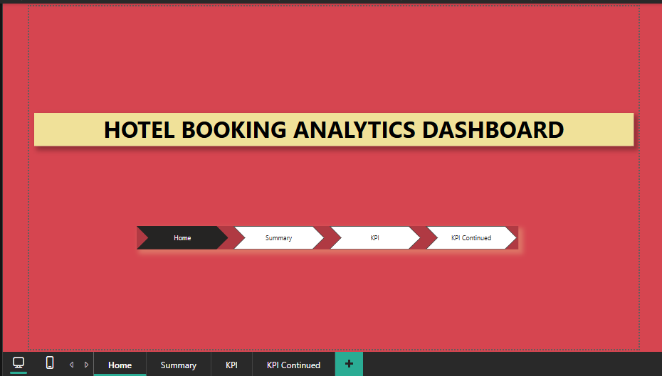
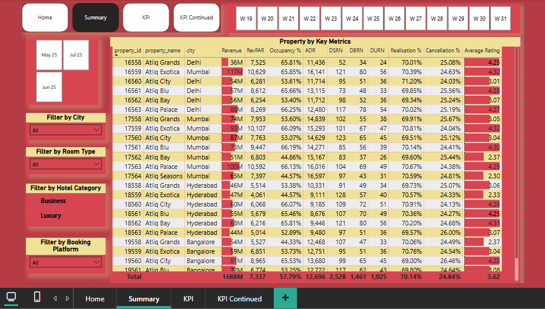
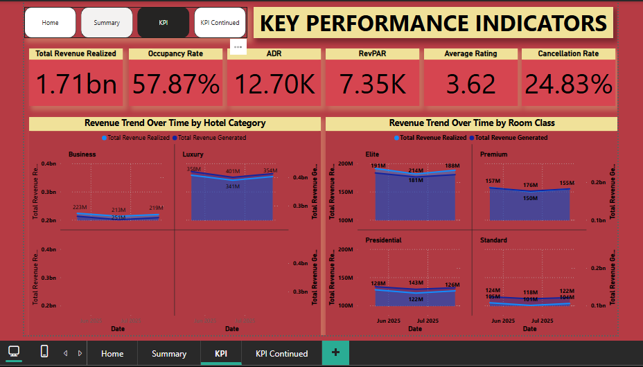
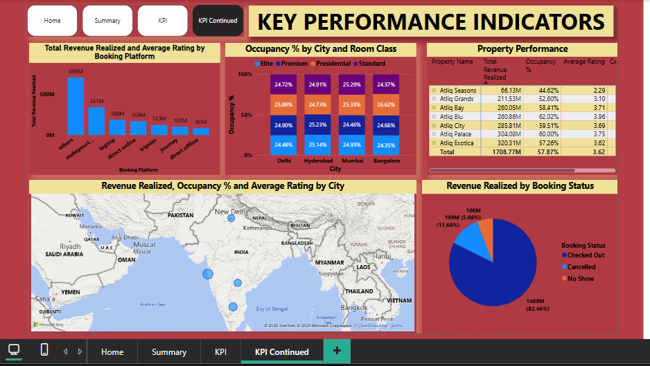

# Hotel Booking Analytics Dashboard: Case of AtliQ Grands in India

## Problem Statement
AtliQ Grands owns multiple five-star hotels across India. They have been in the hospitality industry for the past 20 years. Due to strategic moves from other competitors and ineffective decision-making in management, AtliQ Gand are losing its market share and revenue in the luxury/business hotels category. As a strategic move, the manageing director of AtliQ wanted to incorporate "Business and Data Intelligence" to regain their market share and revenue.  However, they do not have an in-house data analytics team to provide them with these insights.
Their revenue management team had decided to hire a 3rd party service provider to provide them with insights from their historical data.

## Aim of the Project
As a data analyst I was provided with sample data and a mock-up dashboard to work on the following tasks: 
1. Create the metrics according to the metric list.
2. Create dashboard according to the mock-up provided by stakeholders.
3. Create relevant insights that are provided in the metric list/mock-up dashboard.

I downloaded all relevant documents from the link below to:  
![Link:] (https://codebasics.io/resources/end-to-end-data-analyst-project) 

## Tools and Techniques
**Visualization Tool**: Power BI Desktop

## Key Activities
1. **Load and Transform the various data sets** e.g. dim_date and dim_rooms  
2. **Build the Data Model**: use the star schema to build the underlying data model and the required relationships 
3. **Data Analysis Expressions**: Create new columns and measures using DAX expressions that will be useful in creating visualizations.
4. **Dashboard**: Create a compelling and interactive dashboard report from the analysis of the data set that would speak clearly to the business needs for decision making. 
5. **Publish and Share**: Share the final Power BI dashboard and ensure you capture it in your project portfolio website/blog

### Load and Transform the various data sets
The data sets consisted of five different data sets which were extracted, transformed, and loaded into Power BI Desktop. The datasets consisted of **two fact tables** and **three dimensional tables**. They include:
1. fact_aggregated_bookings
2. fact_bookings
3. dim_date
4. dim_hotels
5. dim_rooms

### Build the Data Model
The relationship amongst the five tables were established as shown below:

### Data Analysis Expressions (DAX)
From the above five tables, **key_measures** table was generated using **DAX** Language. 

### Dashboard
A **Dashboard** was designed to capture various outcomes obtained from the datasets as shown below:

This is the Home page showing the landing page of the analysis. 

The summary page provides a brief summary of Property by Key Metrics. This can be filtered via city, room type, hotel category, booking platform, week no, or date.

The KPI page shows how various key measures performed. For instance, the total amount of bookings accounted for 57.87% of the available rooms while the total cancelled bookings accounted for 24.83 %. 
The chart also shows the total amount of revenue generated amount to approximately 1.71 billion. The average rating of 3.62 out of the total 5 reflected the customer satisfaction rate guiding areas of service improvement.
This chart also captured the hotel category and room class revenue trends over time.

This page captures more KPIs. The revenue generated by customers checking out accounted for 82.46% revenue, compared to cancelled, and no show. 
From the map, Delhi experienced the highest occupancy rate of 60.55%, compared to Hyderabad with 58.07%, Mumbai, 57.88%, and Bangalore, 55.77%. Additionally, Delhi led with customer service rating of 3.78, followed by Hyderabad with 3.66, Mumbai, 3.65, and Bangalore, 3.41. However, Mumbai generated the highest revenue followed by Bangalore, Hyderabad, and Delhi, respectively.

### Publish and share
The dashboard was shared on the blog.

## Conclusion
Delhi city was rated best with 3.78 out of 5 according to the customer service average ratings.  On the other hand, Mumbai city generated the highest revenue of approximately 668 million. Delhi city proved to be reliable with 60.55% occupancy rate, compared to the other cities. Jun 25, proved to be of low season due to fluctuation in revenue. Customers preferred other booking platformed compared to the booking platforms provided. Thus, different cities and room class, among other factors contribute to the occupancy or cancellation of hotel bookings influencing revenue generation.
