# Linear Regression using Python

## Objective
This project aims at predicting an outcome (e.g., house prices) based on a single feature (e.g., house area).
It can be achieved through:
* Exploring a real-world dataset
* Preparing and splitting data for training and testing
* Building a simple linear regression model using Scikit-learn’s LinearRegression
* Evaluating the model using key metrics i.e., MAE, MSE, RMSE, and R² Score
* Visualizing predictions and regression lines
* Publishing the project on GitHub/Portfolio

## Project Execution

1. Import relevant libraries
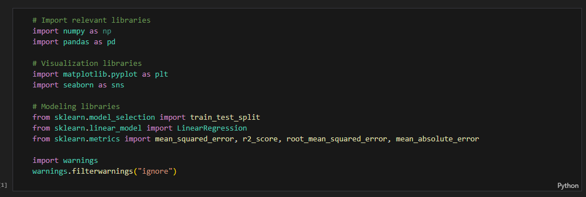

2. Loading the datasets
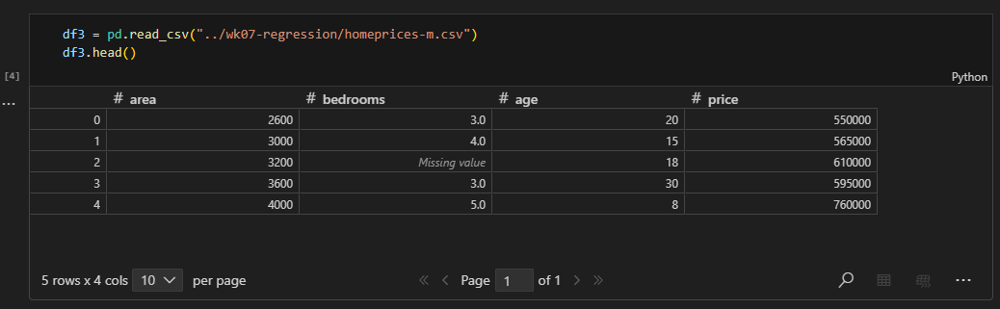
* The dataset consisted of area, bedrooms, age, and price

## Exploratory Data Analysis

3. Checking the shape
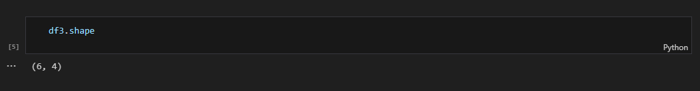
* The dataset consists of 6 rows (inclusive of header) and 4 columns

4. Check for irregularities
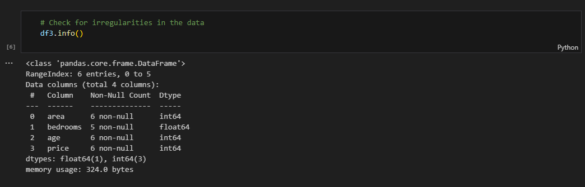
* Presence of missing values in `bedrooms` column
* `bedrooms` should be of integer data type

5. Summary statistics
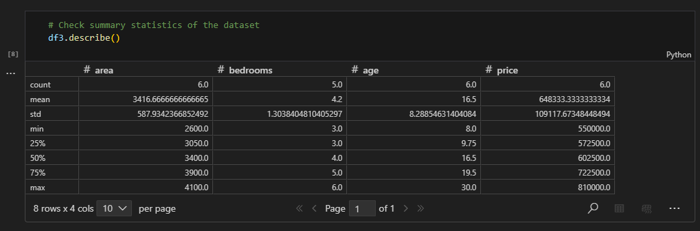

## Impute Missing Values
6. Impute `bedrooms`
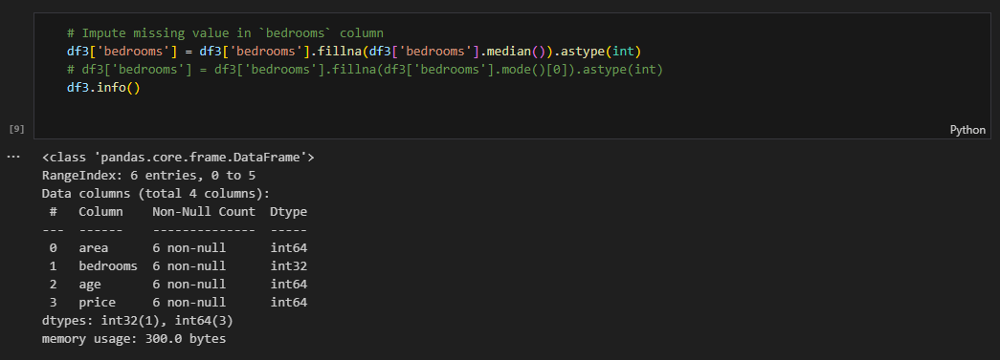
* The missing value was filled by `median` i.e., the middle value of the `bedrooms`, since the value was missing at random (MAR)

## Visualize Data
The visualizations show the relationship between area, bedrooms, and age versus price

7. Scatter Plot of `area` vs `price`
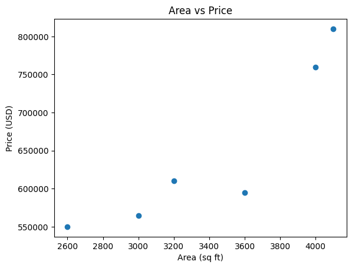

8. Scatter Plot of `bedrooms` vs `price`
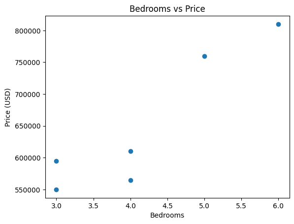

9. Scatter Plot of `age` vs `price`
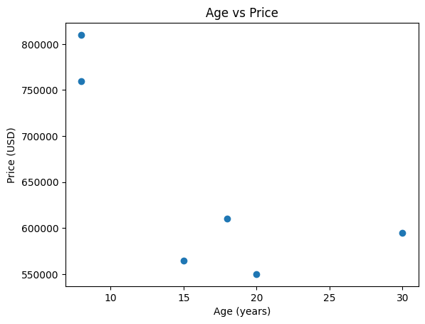

10. Correlation Heatmap 
This shows the relationship between features
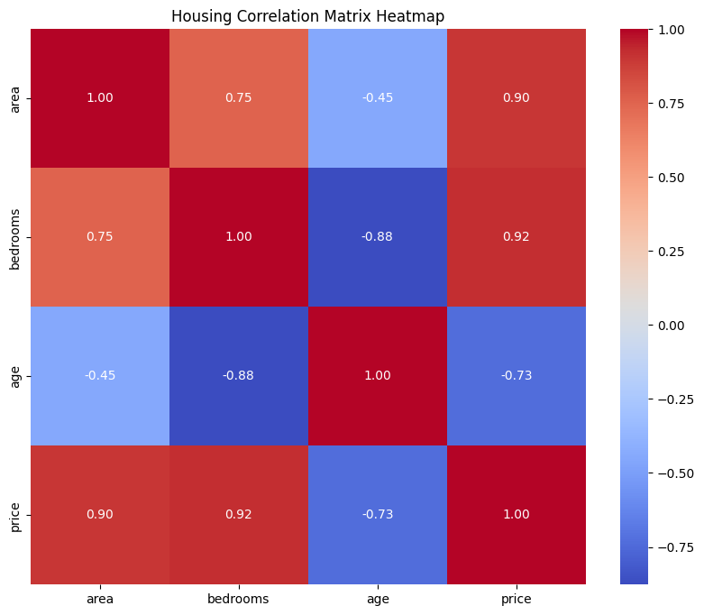
* There `age` of the house has a `negative relationship` with the `price`. As the `age` of the house increases, the `price` decreases.
* The `area` and the `number of bedrooms` show a positive relationship with the `price`. As the `area` and the `number of bedrooms` increases, the `price` of the house also increases.

## Feature Engineering
- Define the `target` and `feature` variables
- Split the dataset into `train` and `test`

11. Define `target` and `feature` variables and split the data into `train` and `test`
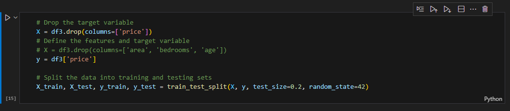

## Model Building

12. Train model
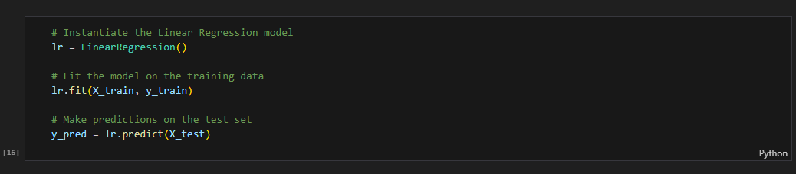

13. Print `Coefficients`
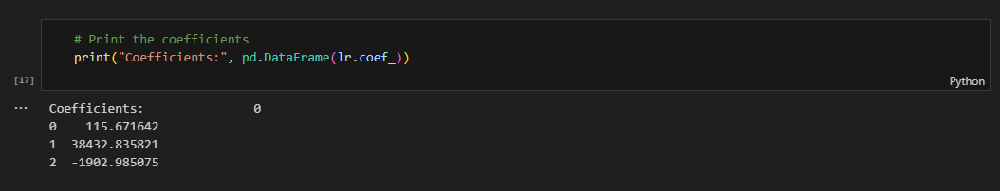

14. Print the `intercept`
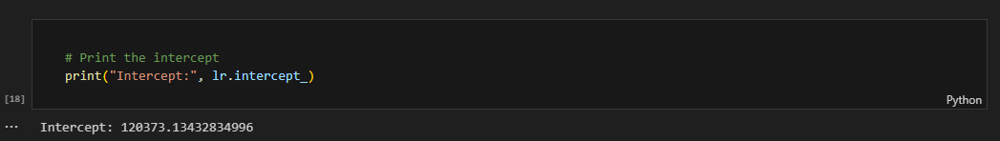

## Evaluate the Model

15. Evaluate the model using `mse`, `r2`, `rmse`, and `mae`
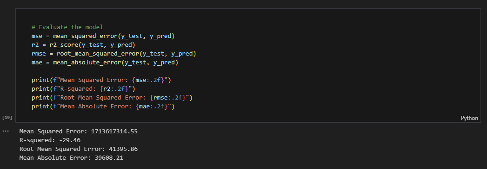

16. `Predicted` vs `Actual`
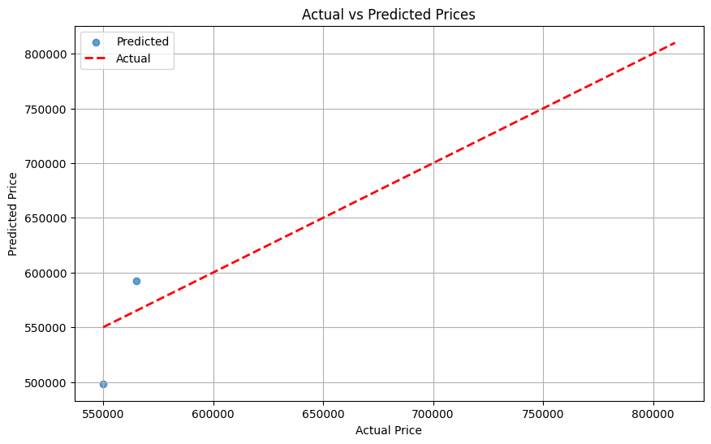

## Conclusion
- The model performed fairly due to the distance between the actual and predicted values. The model can be improved in future by performing hyperparameter tuning. 
- The model is performing poorly due to poor fit between the model and the data which oversimplifies the model causing biasness, thus underfitting. This can be improved by increasing the data.
